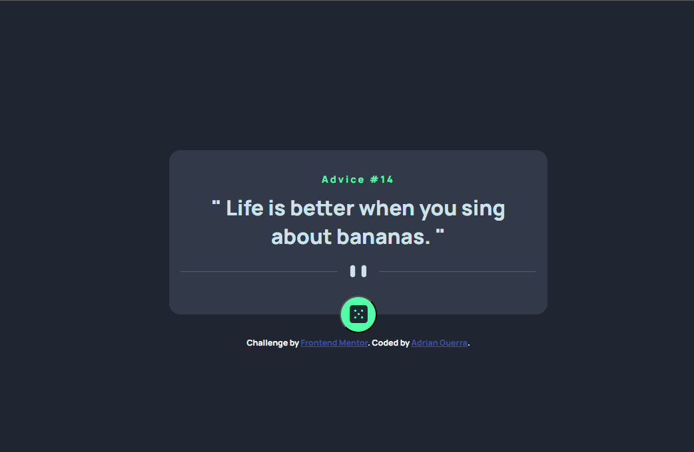

# Frontend Mentor - Advice generator app solution

This is a solution to the [Advice generator app challenge on Frontend Mentor](https://www.frontendmentor.io/challenges/advice-generator-app-QdUG-13db). Frontend Mentor challenges help you improve your coding skills by building realistic projects.

## Table of contents

- [Overview](#overview)
  - [The challenge](#the-challenge)
  - [Screenshot](#screenshot)
  - [Links](#links)
- [My process](#my-process)
  - [Built with](#built-with)
  - [What I learned](#what-i-learned)
  - [Continued development](#continued-development)
- [Author](#author)

## Overview

### The challenge

Users should be able to:

- View the optimal layout for the app depending on their device's screen size
- See hover states for all interactive elements on the page
- Generate a new piece of advice by clicking the dice icon

### Screenshot



### Links

- Solution URL: [https://www.frontendmentor.io/solutions/advice-generator-using-html-css-js-pf7MxhiGqP](https://www.frontendmentor.io/solutions/advice-generator-using-html-css-js-pf7MxhiGqP)
- Live Site URL: [https://advice-generator-app-eta-five.vercel.app/](https://advice-generator-app-eta-five.vercel.app/)

## My process

### Built with

- Semantic HTML5 markup
- CSS custom properties
- Flexbox
- JavaScript
- API Call
- Mobile-first workflow


### What I learned

In this project, I learned how to make calls to an API and display its data in the webpage.

```css
.dice-container {
        position: absolute;
        bottom: -25px;
        align-self: center;
        display: flex;
        justify-content: center;
        border-radius: 50%;
        width: 50px;
        height: 50px;
        background-color: $pr-neon-green;

        .dice {
            width: 24px;
            height: 24px;
            margin: auto 0;
        }

        :hover {
            box-shadow: 0 0 15px 10px $pr-neon-green;
        }
    }
```

I made use of SCSS variables and nesting to add stylings and hover state.

```js
fetch("https://api.adviceslip.com/advice")
    .then(response => response.json())
    
    .then(data => {
        console.log(data.slip);

        id = data.slip.id;
        quote = data.slip.advice;

        console.log(id);
        console.log(quote);

        number.innerText = `Advice #${id}`;
        advice.innerText = `" ${quote} "`;
        
    })
        
    .catch(error => console.log("Error"))
```

In the above code, I fetched data from the API, then assigned its response fields to variables. Next, I added those variables into HTML content.

### Continued development

I want to see what other ways I can utilize API calls to assist in displaying content on a webpage.


## Author

- LinkedIn - [Adrian Guerra](https://www.linkedin.com/in/adrian-guerra-a210a4196/)
- Frontend Mentor - [@adie9](https://www.frontendmentor.io/profile/adie9)
**
